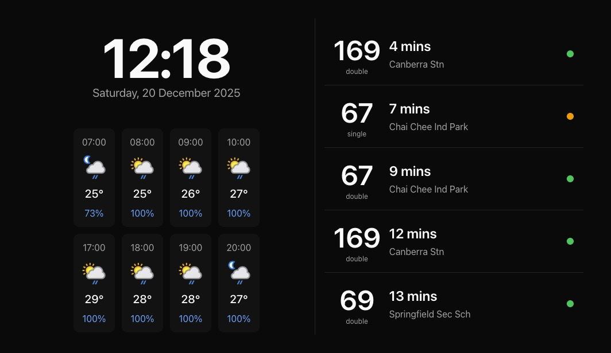

# time-to-leave



## A Google Nest Hub Companion

Time to Leave is a lightweight web application that displays current weather conditions and near-real-time bus arrival information in Singapore using publicly available APIs. It is designed to be cast to Google Nest Hub and similar smart displays, providing a clean, glanceable interface for everyday use for.

**Update bus services config**

Update bus services using the configuration file at ./src/config.ts. Enter your bus service number and bus stop code to begin retrieving bus data. Currently, road name must be added manually since it is not fetched automatically.

**Edit `.env` and add your API keys:**

-   Get your API keys from:
    -   LTA API: https://datamall.lta.gov.sg/content/datamall/en/request-for-api.html
    -   Weather API: https://www.weatherapi.com/

```
LTA_API_KEY=your_lta_api_key_here
WEATHER_API_KEY=your_weather_api_key_here
```
